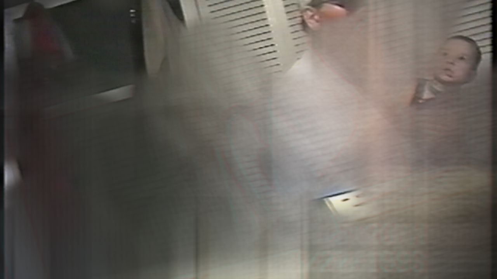

## There, but without the memory

Processing home videos from my childhood in Kentucky. Built with openframeworks + glsl. 

### Setup

1. place videos in data/videos
2. alter ofApp.cpp to load the video you want
